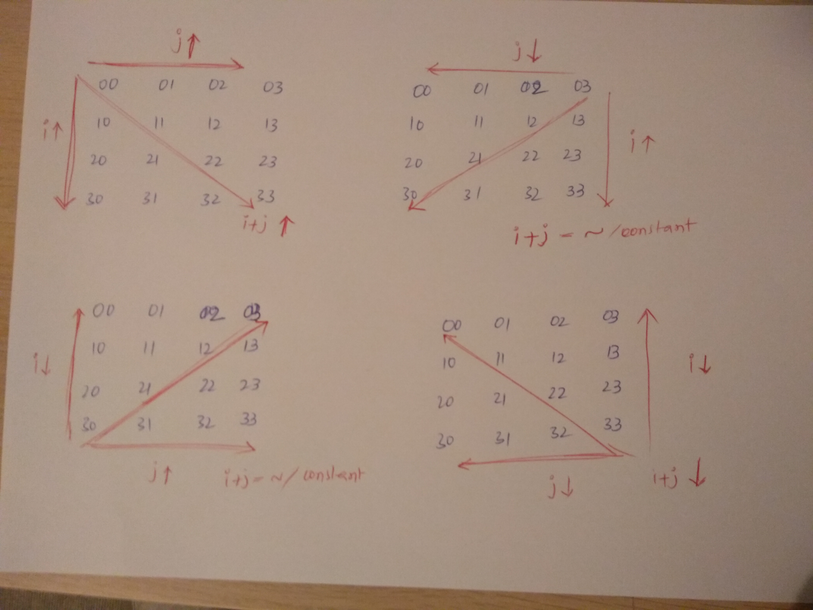

# Patterns

## Important Points

Suppose `n` represents the length of square matrix, `i` is row number and `j` represents column number.

**Main**
lower triangle: `i > j`
main diagonal: `i = j`
upper triangle: `i < j`

**Transpose**
anti lower traingle(transpose): `i + j < n - 1`
anti diagonal(transpose): `i + j = n - 1`
anti upper triangle(transpose): `i + j > n - 1`
